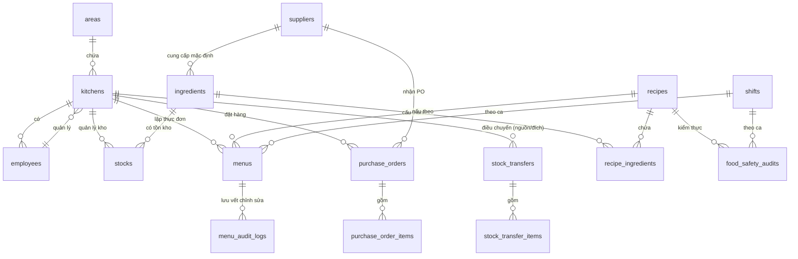

# PROJECT MEMORY — PM_XUATANKIEUMY (Catering Management System)

Tài liệu này lưu giữ toàn bộ ngữ cảnh, kiến trúc kỹ thuật, luồng nghiệp vụ chi tiết và quy tắc cốt lõi của dự án **PM_XUATANKIEUMY** (Quản lý Xuất Ăn Kiểu Mỹ). Đây là cẩm nang hướng dẫn dành cho Techlead và Senior Fullstack Developer khi tiếp cận hoặc phát triển hệ thống.

---

## 1. Tổng Quan Hệ Thống

* **Mã dự án (Codename)**: `PM_XUATANKIEUMY`
* **Công nghệ cốt lõi**: Laravel 12 + Filament v3 Admin Panel + Livewire v3 + Alpine.js + Tailwind CSS.
* **Cơ sở dữ liệu**: MySQL (cấu hình qua cổng `3307`, database `pm_xuatankieumy`).
* **Thời gian thực (Websocket)**: Laravel Reverb phục vụ tính năng Chat Nhóm thời gian thực.
* **Xuất bản dữ liệu**: Sử dụng gói `maatwebsite/excel` (PhpSpreadsheet wrapper) để xuất biểu mẫu tài chính và biểu mẫu kiểm thực của Bộ Y tế (.xlsx).

---

## 2. Bản Đồ Cơ Sở Dữ Liệu (Database Schema)

Hệ thống có 22 models chính liên kết chặt chẽ với nhau:



### Chi tiết các Models chính:
1. **User**: Quản lý tài khoản đăng nhập hệ thống admin.
2. **Area** & **Kitchen**: Phân cấp bếp ăn công nghiệp theo khu vực địa lý. Một Bếp ăn (`Kitchen`) thuộc một Khu vực (`Area`) và do một Nhân viên (`Employee` làm Manager) quản lý.
3. **Employee**, **Shift**, **LeaveOvertime**, **Timekeeping**: Phân hệ nhân sự bếp, lịch làm việc ca, đăng ký nghỉ phép/tăng ca, và bảng chấm công hàng ngày.
4. **Recipe** (Món ăn / Công thức): Định nghĩa tên món ăn, phân loại (món mặn, canh, xào...), mức giá suất ăn dự kiến (`price_level`), đơn giá áp dụng (`actual_price`) và trạng thái (`active`, `pending`, `inactive`).
5. **Ingredient** (Nguyên liệu thô): Định nghĩa mã, tên nguyên liệu, phân loại (`Động vật`, `Thực vật`, `Thực phẩm khô`, `Gia vị`), đơn vị tính chuẩn, nhà cung cấp mặc định và **đơn giá tham chiếu** (`reference_price`).
6. **RecipeIngredient** (Pivot bảng định mức): Định lượng nguyên liệu cần thiết cho **1 phần ăn** (`quantity_per_portion` tính bằng kg/lít) và ghi chú sơ chế.
7. **Menu** (Thực đơn): Lập thực đơn cho từng ngày và ca tại bếp ăn, chứa số suất ăn dự kiến (`estimated_portions`) và trạng thái (`draft`, `sent` - đã gửi khách, `locked` - đã chốt).
8. **MenuAuditLog**: Ghi vết lịch sử chỉnh sửa các trường nhạy cảm trên thực đơn khi thực đơn đó đã ở trạng thái `sent` hoặc `locked`.
9. **Stock** (Tồn kho bếp): Quản lý tồn kho thực tế của từng nguyên liệu tại mỗi bếp. Lưu giữ `quantity` (tồn hiện tại), `frozen_quantity` (số lượng bị đóng băng do đang trong quá trình điều chuyển), `min_quantity` (tồn kho tối thiểu) và `unit_price` (giá vốn nhập kho).
10. **StockTransaction** (Thẻ kho): Lưu nhật ký nhập xuất kho của bếp, ghi nhận biến động số lượng và link chứng từ file đối với nhập ngoài.
11. **StockTransfer** & **StockTransferItem**: Phiếu điều chuyển nguyên liệu giữa bếp xuất (`source_kitchen_id`) và bếp nhận (`dest_kitchen_id`).
12. **Supplier**: Quản lý danh mục nhà cung cấp thực phẩm.
13. **PurchaseOrder** & **PurchaseOrderItem**: Đơn đặt mua hàng gửi nhà cung cấp để nhập nguyên liệu về bếp ăn.
14. **FoodSafetyAudit**: Nhật ký kiểm thực 3 bước và lưu/hủy mẫu thức ăn theo quy chuẩn vệ sinh an toàn thực phẩm của Bộ Y Tế.

---

## 3. Các Luồng Nghiệp Vụ Cốt Lõi & Logic Xử Lý Đặc Thù

### Luồng 1: Định lượng món ăn & Tự động khóa giá vốn (Recipe Costing)
* **Logic**: Giá vốn món ăn (Cost) được tính động trên 1 phần ăn bằng cách lấy: $\sum (\text{Định lượng nguyên liệu/phần} \times \text{Đơn giá tham chiếu của nguyên liệu})$.
* **Logic đặc thù**: Khi Đơn giá tham chiếu (`reference_price`) của nguyên liệu thay đổi ở module *List nguyên liệu* hoặc được đồng bộ từ *Nhà cung cấp*, hệ thống kích hoạt hook `Ingredient::updated` tự động chuyển trạng thái của tất cả các món ăn (`recipes`) đang hoạt động (`active`) có dùng nguyên liệu này sang trạng thái **`pending` (Chờ rà soát)**. Bếp trưởng buộc phải vào rà soát lại định mức cost trước khi đưa món ăn trở lại thực đơn, tránh việc lệch giá vốn món ăn so với thị trường.

### Luồng 2: Lập thực đơn tuần & Ghi vết thay đổi (Menu Auditing)
* **Giao diện**: Custom Page `LapThucDonTuan` hiển thị ma trận Thứ 2 $\to$ Chủ nhật $\times$ Ca 1 $\to$ Ca 4. Người dùng chọn món ăn từ ngân hàng thực đơn và nhập số suất ăn dự kiến.
* **Validation chống lặp món**: Khi chốt thực đơn tuần, hệ thống tự động quét dữ liệu thực đơn 3 tuần trước đó (21 ngày). Nếu phát hiện món ăn đã phục vụ trong khoảng thời gian này, hệ thống sẽ phát tín hiệu cảnh báo (`Notification::warning`) để tránh nhàm chán cho khách hàng, nhưng vẫn cho phép lưu nếu được duyệt.
* **Logic ghi vết (Audit Log)**: Khi thực đơn đã ở trạng thái hoàn tất (`sent` - đã gửi khách hoặc `locked` - đã chốt) mà bị chỉnh sửa hoặc xóa, hook `Menu::updated` / `Menu::deleted` sẽ tự động so sánh giá trị cũ và mới của các trường nhạy cảm (`date`, `shift_id`, `recipe_id`, `estimated_portions`, `status`) và tạo bản ghi vào `MenuAuditLog` ghi nhận rõ: Ai sửa, sửa trường gì, giá trị cũ $\to$ mới, và thời gian thực hiện.

### Luồng 3: Tính toán nhu cầu mua & Tự động gom đơn PO (Purchase Order)
* **Quy trình**:
  1. Người dùng chọn ngày phục vụ và các ca phục vụ tại trang custom `List Hàng`.
  2. Hệ thống quét thực đơn đã chốt của ngày đó, lấy ra danh sách các món ăn và số suất ăn.
  3. Lấy Số suất $\times$ Định lượng của từng món ăn để tự động tính ra tổng số lượng nguyên liệu cần mua.
  4. Gom nhóm nguyên liệu cần mua theo Nhà cung cấp mặc định (`ingredients.supplier_id`).
  5. Tự động sinh các phiếu Đặt hàng nháp (`PurchaseOrder` trạng thái `draft`) kèm theo chi tiết nguyên liệu đặt (`PurchaseOrderItem`) với đơn giá lấy từ đơn giá tham chiếu của nguyên liệu.

### Luồng 4: Nhập kho an toàn (Idempotent PO Stock-in) & Nhập kho ngoài
* **Chống nhập lặp**: Khi thủ kho kiểm hàng PO và chuyển trạng thái từ `checking` sang `done`, hook `PurchaseOrder::updated` sẽ tự động cộng tồn kho vào bảng `stocks` của bếp đó và sinh giao dịch `StockTransaction` có loại `'Nhập kho'`. Để chống việc nhập kho lặp (nếu trạng thái đổi từ `done` $\to$ `checking` $\to$ `done`), hệ thống sử dụng trường **`stocked_at` (timestamp)** làm cờ bảo vệ. Chỉ thực hiện cộng kho khi `status === 'done' && is_null($stocked_at)`, sau đó cập nhật `stocked_at = now()`.
* **Nhập kho ngoài**: Bếp ăn có thể mua trực tiếp nguyên liệu không qua PO. Tính năng này được tích hợp tại Header Action của `StockResource` (Nhập kho ngoài). Bắt buộc phải upload file ảnh hóa đơn/chứng từ đính kèm (`attachment` là `required`). Khi thực hiện thành công, hệ thống sinh mã chứng từ dạng `NX-EXT-YYYYMMDD-xxx` lưu vào `voucher_code` của `StockTransaction`.

### Luồng 5: Điều chuyển nguyên liệu & Đóng băng tồn kho (Frozen Stock Transfer)
* **Nghiệp vụ**: Khi bếp xuất tạo phiếu điều chuyển nguyên liệu đến bếp nhận (`StockTransfer` ở trạng thái `'Đang chuyển'`), lượng nguyên liệu điều chuyển sẽ được **đóng băng** tại bếp xuất bằng cách tăng giá trị `frozen_quantity` trên bảng `stocks`.
* **Available Quantity**: Lượng hàng thực tế khả dụng của bếp xuất lúc này = `quantity - frozen_quantity`. Điều này ngăn bếp xuất dùng mất lượng hàng đang đi đường.
* **Xác nhận**: Khi bếp nhận nhấn "Xác nhận nhận hàng", hệ thống sẽ:
  - Trừ tồn kho thực tế (`quantity`) và giải phóng đóng băng (`frozen_quantity`) ở bếp xuất, tạo giao dịch `Xuất chuyển kho`.
  - Cộng tồn kho thực tế (`quantity`) ở bếp nhận, tạo giao dịch `Nhập chuyển kho`.
  - Chuyển trạng thái phiếu sang `'Hoàn thành'`.
* **Hủy phiếu**: Nếu phiếu bị hủy, hệ thống chỉ giải phóng lượng đóng băng (`frozen_quantity` giảm) ở bếp xuất, tồn kho thực tế giữ nguyên.

### Luồng 6: Kiểm thực 3 bước chuẩn Bộ Y Tế (Food Safety Audit)
* **Nghiệp vụ**: Quy trình kiểm tra vệ sinh an toàn thực phẩm thực hiện theo Quyết định 1246/QĐ-BYT gồm:
  - **Bước 1**: Kiểm tra trước chế biến (nguyên liệu đầu vào nhập trong ngày: cảm quan, khối lượng, hóa đơn, thú y...).
  - **Bước 2**: Kiểm tra khi chế biến (món ăn chế biến lúc mấy giờ, nhiệt độ nấu...).
  - **Bước 3**: Kiểm tra trước khi ăn (món ăn trước khi chia suất, cảm quan, nhiệt độ...).
  - **Lưu mẫu**: Theo dõi lưu mẫu thức ăn trong tủ lưu từ 2-8°C, ghi nhận mã mẫu, người thực hiện, thời gian lưu và thời gian hủy mẫu sau 24 giờ.
* **Giao diện**: Form nhập liệu `FoodSafetyAuditResource` tự động ẩn hiện các trường nhập liệu thông minh phù hợp với từng Bước kiểm thực được chọn (sử dụng Livewire state binding).
* **Xuất Excel**: Trang custom `Kiểm thực 3 bước` hỗ trợ xuất file Excel báo cáo kiểm thực đa sheet (mỗi bước là một sheet riêng biệt), định dạng gộp ô tiêu đề và tiêu đề cột chính xác theo biểu mẫu BYT quy định.

---

## 4. Các Custom Pages & Giao Diện Đặc Sắc

Hệ thống có nhiều trang giao diện tùy biến rất đẹp, đáp ứng tiêu chí giàu trải nghiệm trực quan:

1. **Thống kê / Dashboard (`Dashboard.php`)**: Giao diện tổng quan bếp ăn với các widget động: tổng số ca phục vụ, suất ăn, giá trị tồn kho, cảnh báo nguyên liệu sắp hết hàng dưới dạng đồ họa trực quan.
2. **Kho hàng (`warehouse.blade.php`)**: Giao diện quản lý kho đa tab (Tồn kho, Nhập/Xuất kho trực tiếp, Kiểm kê chênh lệch cuối ngày và Nhật ký thẻ kho). Tab *Kiểm kê cuối ngày* cho phép so sánh số lượng thực tế đếm được và số lượng tồn hệ thống, tính toán chênh lệch và cập nhật nhanh tồn kho kèm ghi chú lý do hao hụt.
3. **Chi tiết Món ăn (`view-detail.blade.php`)**: Trang chi tiết công thức thiết kế như một Dashboard thu nhỏ. Hiển thị thông số nguyên liệu cấu thành, biểu đồ hình tròn (SVG động) thể hiện tỷ lệ cơ cấu chi phí (cost) nguyên liệu cấu thành món ăn, lịch sử thay đổi đơn giá nguyên liệu của nhà cung cấp.
4. **Báo cáo tài chính (`bao-cao.blade.php`)**: Cho phép lọc khoảng ngày, ca và tìm kiếm món ăn/nguyên liệu. Tính toán tự động tổng giá vốn thực đơn hàng ngày và xuất báo cáo Excel tài chính có định dạng số chuyên nghiệp.
5. **Kiểm thực (`food-safety-audit.blade.php`)**: Hiển thị bảng biểu chi tiết cho từng ca, từng bước của quy trình kiểm thực, hỗ trợ các Action chuyển đổi nhanh giữa các bước và xuất Excel gộp sheet.

---

## 5. Quy Chuẩn Kỹ Thuật Cho Developer (Senior/Techlead guidelines)

### Quy tắc thiết kế database & migration:
* Khi cập nhật hoặc chỉnh sửa bất kỳ cột nào của bảng thông qua migration, **bắt buộc phải khai báo đầy đủ tất cả các thuộc tính của cột đó** (như default value, nullability, comment...) để tránh việc Laravel 12 làm mất thuộc tính cũ trong quá trình ALTER.
* Tuân thủ quy tắc custom: **Luôn sử dụng MySQL làm Database mặc định** thay vì SQLite. Các Filament Resource được sinh tự động thông qua `php artisan make:filament-resource ModelName --generate` để tận dụng tối đa cơ chế truy vấn tự động của Filament.

### Quản lý Code style (Laravel Pint):
* Trước khi commit bất kỳ thay đổi nào trên file PHP, bắt buộc phải chạy lệnh format code:
  ```bash
  vendor/bin/pint --dirty --format agent
  ```

### Kiểm thử (PHPUnit Feature Tests):
* Các ca kiểm thử quan trọng đã được viết trong thư mục `tests/Feature/` nhằm đảm bảo hệ thống không bị lỗi logic nghiệp vụ khi refactor.
* Chạy test bằng lệnh:
  ```bash
  php artisan test --compact
  ```
  Hoặc chạy một test cụ thể:
  ```bash
  php artisan test --compact --filter=PurchaseOrderStockSyncTest
  ```

---

## 6. Trạng Thế Hiện Tại & Backlog (Phân tích khoảng trống)

Dựa trên việc đối chiếu file `NV_XUATANKIEUMY.xlsx` với codebase hiện tại:
* **Đã hoàn tất (P1 & P2)**: Lập thực đơn tuần ma trận grid, menu audit log lưu vết, công thức tự pending khi đổi giá, guard chống nhập lặp PO (`stocked_at`), nhập kho ngoài đính kèm chứng từ, chuyển kho đóng băng (`frozen_quantity`), kiểm thực 3 bước ghi nhận dữ liệu thật, xuất Excel báo cáo tài chính và báo cáo kiểm thực BYT.
* **Chưa có / Backlog cần triển khai tiếp (P3 & P4)**:
  1. **Pivot Báo giá đa Nhà cung cấp (`supplier_ingredient`)**: Hiện tại hệ thống đang dùng mối quan hệ 1-N qua cột `ingredients.supplier_id` (mỗi nguyên liệu chỉ gán 1 nhà cung cấp mặc định). Theo BA, cần phát triển bảng pivot `supplier_ingredient` (có thêm đơn giá `price` của từng nhà cung cấp trên pivot) để hỗ trợ so sánh giá nguyên liệu giữa nhiều nhà cung cấp khi tạo PO.
  2. **Phân cấp Kho đa bếp**: Hoàn thiện triệt để việc cô lập kho và phân quyền truy cập theo `kitchen_id`. Cài đặt Filament Shield hoặc Spatie Laravel Permission để phân quyền cho các vai trò như: Admin, Thủ kho, Bếp trưởng, Nhân viên phục vụ.
  3. **Chat nhóm phân kênh**: Hiện tại màn hình Chat nhóm mới chỉ ở mức giao diện Mock Livewire lưu tin nhắn DB. Cần kết nối Reverb hoàn chỉnh để chạy websocket realtime.
