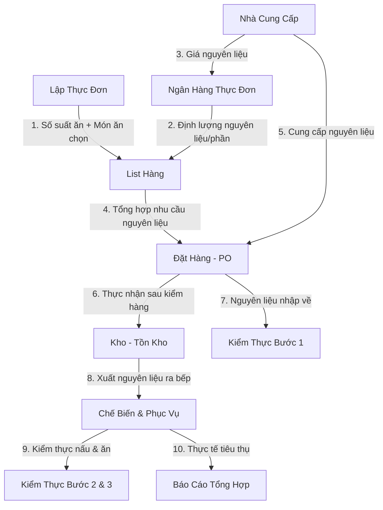

# Phân Tích Nghiệp Vụ Module Quản Lý Xuất Ăn (Catering Management)

Tài liệu này phân tích chi tiết luồng nghiệp vụ của phân hệ **XUẤT ĂN** (được khoanh đỏ trong thiết kế của hệ thống Bluefire Group) dựa trên cấu trúc dữ liệu và logic xử lý của hệ thống.

---

## 1. Tổng Quan Phân Hệ Xuất Ăn
Phân hệ này giải quyết bài toán quản lý chuỗi cung ứng thực phẩm khép kín cho các nhà ăn tập thể (canteen công nghiệp, trường học, bệnh viện), bao gồm các khâu:
`Định nghĩa món ăn (Recipe) -> Lập thực đơn (Menu Planning) -> Tính toán nhu cầu mua (Shopping List) -> Đặt hàng nhà cung cấp (Purchase Order) -> Kiểm hàng & Quản lý kho (Warehouse & Inventory) -> Kiểm thực an toàn thực phẩm (Food Safety) -> Báo cáo tổng hợp`.

---

## 2. Chi Tiết Nghiệp Vụ Từng Tiểu Mục (Sidebar Menu)

### 2.1. Ngân Hàng Thực Đơn (Menu Bank)
* **Khái niệm**: Là nơi quản lý công thức (Recipe) và định mức nguyên liệu cấu thành cho từng món ăn trên **1 suất ăn (phần ăn)**.
* **Các chỉ số chính**:
  * **Mức giá suất ăn**: Mức giá bán ra dự kiến (ví dụ: suất ăn 20.000 đ, 25.000 đ...).
  * **Đơn giá suất ăn**: Giá thực tế áp dụng.
  * **Tổng định lượng/phần**: Tổng trọng lượng nguyên liệu thô cần dùng cho 1 phần ăn (tính bằng kg).
  * **Tổng Cost nguyên liệu/phần**: Tổng chi phí nguyên liệu gốc cho 1 phần ăn (tính bằng cách lấy định lượng nguyên liệu × đơn giá mua từ nhà cung cấp).
* **Quy trình vận hành**:
  * Khi thêm mới món ăn, người dùng khai báo các nguyên liệu đi kèm và định lượng (kg/phần).
  * Hệ thống tự động khóa đơn giá nguyên liệu (lấy từ phân hệ Nhà cung cấp/Kho) và tự động tính toán tổng giá vốn (Cost) của món ăn trên 1 phần ăn theo thời gian thực.
  * Trạng thái món ăn: `Đang áp dụng` (Active), `Chờ rà soát` (Pending Review), `Ngưng áp dụng` (Inactive).

### 2.2. Kho (Warehouse / Inventory)
* **Khái niệm**: Quản lý lượng nguyên vật liệu lưu kho thực tế tại bếp ăn.
* **Các nghiệp vụ chính**:
  * **Tồn kho hiện tại (Stock)**: Xem số lượng tồn kho của từng nguyên liệu, giá trị tồn kho, định mức tồn tối thiểu (`min`) để cảnh báo hết hàng (`Hết hàng`, `Sắp hết`, `Đủ hàng`).
  * **Kiểm kho cuối ngày (Check/Audit)**: So sánh số tồn trên hệ thống với số thực tế đếm được (`actual`), tính toán chênh lệch (hao hụt, dôi dư) và ghi nhận lý do dôi dư/hao hụt. Hệ thống tự động cập nhật số tồn kho thực tế sau khi xác nhận chốt kiểm tồn.
  * **Nhập kho (In) / Xuất kho (Out)**: Ghi nhận các biến động kho hàng ngày (nhập thêm nguyên liệu từ nhà cung cấp hoặc xuất nguyên liệu ra bếp chế biến) kèm mã chứng từ tham chiếu.
  * **Nhật ký kho (Log)**: Ghi lại toàn bộ lịch sử các giao dịch nhập, xuất, kiểm kê cuối ngày.

### 2.3. List Hàng (Catering Item list / Shopping List)
* **Khái niệm**: Bảng tính toán nhu cầu nguyên liệu cần chuẩn bị cho một ngày hoặc một tuần làm việc cụ thể.
* **Logic xử lý**:
  * Người dùng chọn ngày phục vụ và các ca (Ca 1, Ca 2, Ca 3, Ca 4).
  * Hệ thống sẽ kiểm tra thực đơn đã lập cho ngày/ca đó, lấy ra danh sách các món ăn dự kiến phục vụ.
  * Lấy số lượng suất ăn dự kiến của ca đó × định lượng nguyên liệu của từng món trong Ngân hàng thực đơn để **tự động tính ra tổng số kg nguyên liệu cần mua/chuẩn bị**.
  * Bảng tổng hợp hiển thị: *Tổng số ca phục vụ, tổng số suất ăn, tổng số món ăn cần nấu, tổng số loại nguyên liệu cần chuẩn bị*.

### 2.4. List Nguyên Liệu (Ingredient Catalog)
* **Khái niệm**: Danh mục toàn bộ các loại nguyên liệu thô sử dụng trong hệ thống.
* **Thông tin quản lý**:
  * Phân loại nguyên liệu: `Động vật` (Thịt, cá, gà...), `Thực vật` (Rau, củ, quả...), `Thực phẩm khô` (Mỳ, bún khô...), `Gia vị`.
  * Đơn vị tính chuẩn: `Kg`, `Gói`, `Chai`, `Thùng`, `Lít`.
  * Nhà cung cấp mặc định đảm nhận cung ứng nguyên liệu đó.

### 2.5. Nhà Cung Cấp (Suppliers)
* **Khái niệm**: Quản lý thông tin các nhà cung cấp thực phẩm và bảng giá nguyên liệu của họ.
* **Logic xử lý**:
  * Phân loại nhà cung cấp theo loại thực phẩm: `Thịt`, `Rau củ`, `Thực phẩm khô`, `Gia vị`, `Hải sản`, `Tổng hợp`.
  * **Bản đồ nguyên liệu (Ingredient Map)**: Cho phép gán các nguyên liệu cụ thể mà nhà cung cấp này cung cấp kèm theo báo giá chi tiết (`cost`).
  * Khi lưu, giá của nguyên liệu này sẽ được đồng bộ làm cơ sở tính Cost cho món ăn ở mục *Ngân hàng thực đơn*.

### 2.6. Đặt Hàng (Purchase Orders)
* **Khái niệm**: Quy trình tạo đơn mua hàng và đối soát hàng hóa bàn giao từ nhà cung cấp.
* **Quy trình vận hành**:
  1. **Tạo đơn đặt hàng (PO)**: Hệ thống cho phép gộp nhu cầu nguyên liệu từ mục *List hàng* (theo ngày hoặc theo tuần) để tạo thành các phiếu đặt hàng. Các mặt hàng tự động gom nhóm và phân bổ theo Nhà cung cấp đã cấu hình. Hỗ trợ tách phiếu đặt hàng thành nhiều phiếu phụ nếu cần.
  2. **Gửi NCC**: Đơn hàng chuyển sang trạng thái `Đã gửi NCC`.
  3. **Kiểm hàng (Checking)**: Khi nhà cung cấp giao hàng đến bếp, thủ kho thực hiện đối chiếu số lượng đặt trên hệ thống và số lượng thực nhận để tính chênh lệch thừa/thiếu, ghi nhận lý do và cập nhật trạng thái đơn hàng.
  4. **Hoàn thành (Done)**: Khi toàn bộ hàng được đối soát xong, đơn hàng được chốt và số lượng nguyên liệu thực nhận sẽ tự động cộng vào tồn kho hiện tại ở phân hệ *Kho*.

### 2.7. Lập Thực Đơn (Menu Planning)
* **Khái niệm**: Lên kế hoạch thực đơn phục vụ cho các Canteen theo tuần hoặc theo ngày.
* **Cơ chế hoạt động**:
  * **Thiết lập Ca**: Quản lý danh sách ca làm việc (ví dụ: Ca 1 - Ca Trưa, Ca 2 - Ca Chiều, Ca 3 - Ca Đêm, Ca 4).
  * **Grid Tuần**: Giao diện ma trận Thứ 2 -> Chủ nhật × Ca 1 -> Ca 4. Người dùng chọn món ăn cho từng bữa từ *Ngân hàng thực đơn* (ví dụ: món mặn, món xào, món canh...).
  * **Khai báo Suất ăn**: Nhập số lượng suất ăn dự kiến cho mỗi ô trong ma trận để làm căn cứ tính toán định lượng ở mục *List hàng*.
  * **Chốt thực đơn**: Thực đơn sau khi lập xong sẽ chuyển từ trạng thái `Nháp` (Draft) sang `Đã chốt` (Locked) để khóa dữ liệu, tránh sửa đổi khi đã bắt đầu mua hàng và chế biến.

### 2.8. Kiểm Thực 3 Bước (Food Safety Inspection)
* **Khái niệm**: Thực hiện quy trình kiểm tra vệ sinh an toàn thực phẩm 3 bước theo quy định của **Bộ Y Tế Việt Nam (Quyết định 1246/QĐ-BYT)**.
* **Chi tiết 3 bước nghiệp vụ**:
  * **Bước 1 (Kiểm tra trước khi chế biến)**: Kiểm tra nguyên liệu đầu vào nhập trong ngày (nhiệt độ, khối lượng, cảm quan, thông tin hóa đơn chứng từ, nhà cung cấp). Phân nhóm theo nhóm thực phẩm tươi sống, rau củ quả, thực phẩm khô.
  * **Bước 2 (Kiểm tra khi chế biến)**: Kiểm tra vệ sinh trong quá trình nấu nướng, thời gian sơ chế, thời gian nấu xong, cảm quan của món ăn và tình trạng trang thiết bị của từng ca.
  * **Bước 3 (Kiểm tra trước khi ăn)**: Kiểm tra cảm quan món ăn trước khi chia suất, dụng cụ chứa đựng và thời gian bắt đầu ăn của từng ca.
  * **Theo theo dõi lưu mẫu (Bước 4 & 5)**: Theo dõi việc lưu mẫu thức ăn (khối lượng mẫu, dụng cụ lưu inox, nhiệt độ tủ lưu 2-8°C, thời gian lưu mẫu, thời gian hủy mẫu sau 24h và chữ ký người thực hiện). Phân chia biểu mẫu lưu mẫu cho Ca chính (Ca trưa) và các Ca phụ còn lại.
* **Đầu ra**: Hỗ trợ xuất biểu mẫu báo cáo Excel chuẩn theo mẫu B1, B2, B3 quy định của Bộ Y Tế.

### 2.9. Báo Cáo (Reports)
* **Khái niệm**: Tổng hợp số liệu thống kê phục vụ công tác quản lý và tối ưu chi phí.
* **Dữ liệu phân tích**: Thống kê số lượng suất ăn tiêu thụ, số lượt món ăn đã nấu, định lượng nguyên liệu thực tế tiêu hao theo khoảng thời gian tùy chọn (ngày/tuần/tháng) và theo ca phục vụ.

---

## 3. Sơ Đồ Luồng Dữ Liệu Liên Kết (Data Workflow)

Sự tương tác giữa các nghiệp vụ được mô tả qua quy trình khép kín sau:

---

## 4. Đánh Giá & Điểm Lưu Ý Cho Lập Trình (Filament Resource Planning)
Khi xây dựng các Resource trong Filament PHP cho phân hệ này, cần chú ý:
1. **Liên kết giá trị**: Giá nguyên liệu của Nhà cung cấp phải tự động cập nhật vào trường `cost` của Món ăn thông qua quan hệ database (HasMany/BelongsTo) để tránh sai lệch dữ liệu.
2. **Xử lý số lượng lớn (Bulk Actions)**: Khi tạo đơn hàng từ List hàng, cần tối ưu hóa câu lệnh Eloquent để tránh N+1 query khi tính tổng số lượng của hàng trăm nguyên liệu nhân với hàng nghìn suất ăn.
3. **Trạng thái quy trình (State Machine)**: Đơn đặt hàng (PO) cần được kiểm soát trạng thái chặt chẽ: `Draft -> Sent -> Checking -> Done`. Chỉ khi đơn hàng ở trạng thái `Done`, số lượng thực tế mới được cộng vào bảng tồn kho.
4. **Kiểm thực 3 bước**: Do đặc thù biểu mẫu Excel của Bộ Y Tế rất phức tạp (nhiều ô gộp cột/dòng), cần thiết lập tính năng xuất Excel sử dụng thư viện thích hợp (như PhpSpreadsheet) để giữ đúng định dạng pháp lý.
